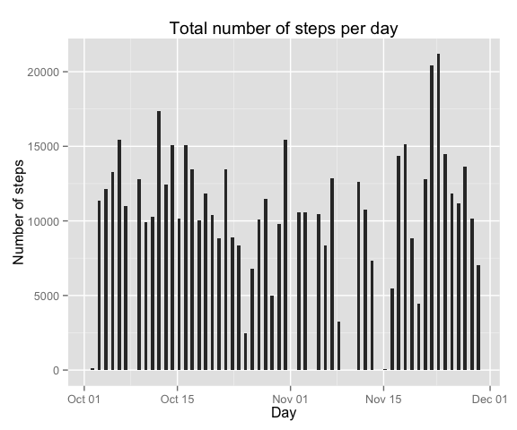
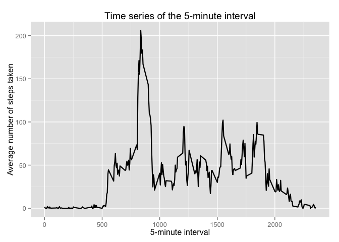
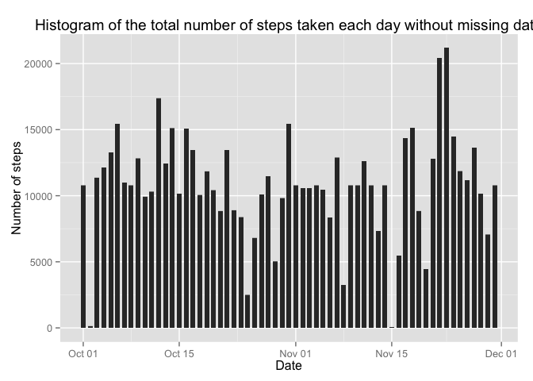
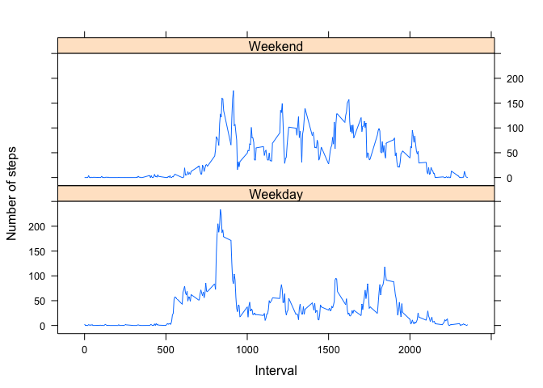

# Reproducible Research: Peer Assessment 1


## Loading and preprocessing the data


```r
# Reading data
df_orig <- read.csv(file = "activity.csv",head = TRUE, sep = ",")
df <- df_orig

# Formating data
df$date <- as.Date(df$date)
df$interval <- as.numeric(df$interval)
```


## What is mean total number of steps taken per day?

Creating aggregation mean values of steps over days

```r
steps_per_day <- aggregate(steps ~ date,
                      data=df,
                      FUN=sum)
```


```r
library(ggplot2)
p<- qplot(date, data = steps_per_day, weight=steps, geom = "bar", binwidth = 0.5) +
    scale_y_continuous("Number of steps")
p + labs(title = "Total number of steps per day")  + xlab("Day")
```

 

Calculating mean and median number of steps

```r
mean_steps_per_day <- mean(steps_per_day$steps)
median_steps_per_day <- median(steps_per_day$steps)
```

Mean number of steps per day is: 10766.189
Median number of steps per day is: 10765


## What is the average daily activity pattern?


```r
df<-na.omit(df)
average_steps <- aggregate(df$steps, list(interval = df$interval), FUN = "mean")

ggplot(average_steps, aes(interval, x)) + 
    geom_line(size = 0.8) + 
    labs(title = "Time series of the 5-minute interval") +
    xlab("5-minute interval") +
    ylab("Average number of steps taken")
```

 

Which 5-minute interval, on average across all the days in the dataset, contains the maximum number of steps?


```r
average_steps[average_steps$x == max(average_steps$x),]
```

```
##     interval        x
## 104      835 206.1698
```


## Imputing missing values

Total number of rows with missing values

```r
dim(df_orig[is.na(df_orig)==TRUE,])
```

```
## [1] 2304    3
```

* Devise a strategy for filling in all of the missing values in the dataset. The strategy does not need to be sophisticated. For example, you could use the mean/median for that day, or the mean for that 5-minute interval, etc.
* Create a new dataset that is equal to the original dataset but with the missing data filled in.

We use the strategy of replacing the missing values by the mean values of the corresponding time interval


```r
df2 <- df_orig
for (i in 1:nrow(df2)){
    if(is.na(df2$steps[i])){
       df2$steps[i] <- average_steps[which(df2$interval[i] == average_steps$interval), ]$x
    }
}
head(df2)
```

```
##       steps       date interval
## 1 1.7169811 2012-10-01        0
## 2 0.3396226 2012-10-01        5
## 3 0.1320755 2012-10-01       10
## 4 0.1509434 2012-10-01       15
## 5 0.0754717 2012-10-01       20
## 6 2.0943396 2012-10-01       25
```

No rows with missing values left

```r
sum(is.na(df2))
```

```
## [1] 0
```


### Make a histogram of the total number of steps taken each day and Calculate and report the mean and median total number of steps taken per day. 


```r
ggplot(df2, aes(as.Date(date), steps)) + 
    geom_bar(stat = "identity",width = 0.7) +
    labs(title = "Histogram of the total number of steps taken each day without missing data", x = "Date", y = "Number of steps")
```

 

Mean total number of steps taken per day

```r
steps_per_day_na_replaced <- aggregate(steps ~ date,
                      data=df2,
                      FUN=sum)
head(steps_per_day_na_replaced)
```

```
##         date    steps
## 1 2012-10-01 10766.19
## 2 2012-10-02   126.00
## 3 2012-10-03 11352.00
## 4 2012-10-04 12116.00
## 5 2012-10-05 13294.00
## 6 2012-10-06 15420.00
```

```r
mean_na_replaced_steps_perday <- mean(steps_per_day_na_replaced$steps)
mean_na_replaced_steps_perday
```

```
## [1] 10766.19
```

Median total number of steps taken per day

```r
median_na_replaced_steps_perday <- median(steps_per_day_na_replaced$steps)
```

Compare them with the two before imputing missing data

```r
mean_steps_per_day
```

```
## [1] 10766.19
```

```r
median_steps_per_day
```

```
## [1] 10765
```

```r
mean_na_replaced_steps_perday
```

```
## [1] 10766.19
```

```r
median_na_replaced_steps_perday
```

```
## [1] 10766.19
```

During the missing value imputation the mean value of the steps per day remained
the same. But the median value of steps per day increased.

## Are there differences in activity patterns between weekdays and weekends?

Create a new factor variable in the dataset with two levels -- "weekday" and "weekend" indicating whether a given date is a weekday or weekend day.


```r
df$day <- factor(weekdays(df$date))
levels(df$day) <- list(Weekday = c("Monday","Tuesday", "Wednesday","Thursday","Friday"),
                       Weekend = c("Saturday","Sunday"))

table((df$day))
```

```
## 
## Weekday Weekend 
##   11232    4032
```


Make a panel plot containing a time series plot (i.e. type = "l") of the 5-minute interval (x-axis) and the average number of steps taken, averaged across all weekday days or weekend days (y-axis).

```r
steps_per_weekdays <- aggregate(df$steps,
                                list(interval = as.numeric(as.character(df$interval)), 
                                weekdays = df$day),
                      data=df,
                      FUN="mean")

library(lattice)
xyplot(steps_per_weekdays$x ~ steps_per_weekdays$interval | steps_per_weekdays$weekday, 
       layout = c(1, 2), type = "l", 
       xlab = "Interval", ylab = "Number of steps")
```

 

